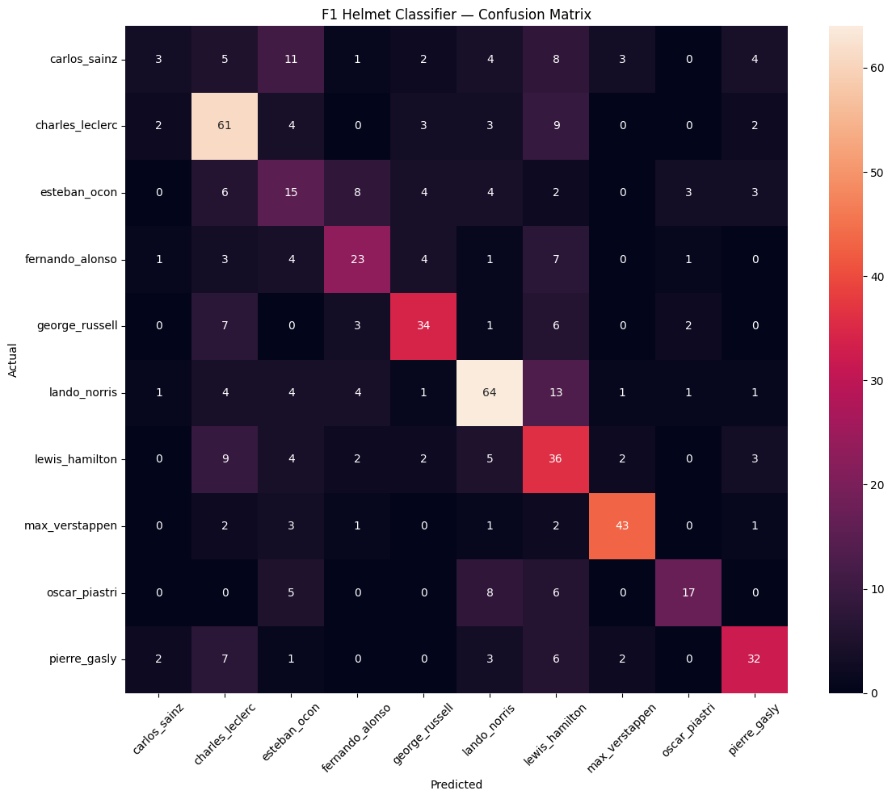

# f1-helmet-classifier
A deep learning image classifier that identifies Formula 1 drivers from their helmet designs using transfer learning on VGG16.
# 🏎️ F1 Driver Helmet Classifier

A deep learning image classifier that identifies Formula 1 drivers from their helmet designs using transfer learning on VGG16.

---

## 📌 Overview

Formula 1 drivers are instantly recognizable by their helmets — each one is a unique piece of art, custom-designed per race and per season. This project trains a convolutional neural network to learn those visual patterns and predict which driver a helmet belongs to, just from a photo.

- **Model:** VGG16 pretrained on ImageNet (transfer learning)
- **Classes:** 10 F1 drivers from the 2026 grid
- **Validation Accuracy:** 61%
- **Dataset:** Custom built — scraped from Racing Helmets Garage

---

## 🏁 Drivers Classified

| Driver | Images in Dataset |
|---|---|
| Lando Norris | 468 |
| Charles Leclerc | 418 |
| Lewis Hamilton | 313 |
| Pierre Gasly | 264 |
| Max Verstappen | 268 |
| George Russell | 267 |
| Esteban Ocon | 225 |
| Fernando Alonso | 221 |
| Carlos Sainz | 206 |
| Oscar Piastri | 179 |

---

## 📁 Project Structure

```
f1_helmet_classifier/
│
├── f1_helmet_classifier.ipynb   # Main notebook
├── README.md                    # This file
└── confusion_matrix.png         # Evaluation results
```

---

## ⚙️ Pipeline

### 1. Data Collection
Helmet images were scraped from [Racing Helmets Garage](https://racinghelmetsgarage.blogspot.com) — a dedicated archive that documents every unique helmet design used by racing drivers. Images were collected per driver covering the past 10 seasons including standard and special edition GP helmets. No pre-existing dataset was used — the entire dataset was built from scratch.

### 2. Data Cleaning
- Duplicate images removed using MD5 hashing
- Corrupt and undersized images (below 150×150px) discarded
- Final dataset: **2,829 images across 10 drivers**

### 3. Preprocessing
- All images resized to **224×224px** (VGG16 input requirement)
- Pixel values normalized to **[0, 1]**
- **80/20 train/validation split** with stratification

### 4. Model Architecture
```
VGG16 (pretrained on ImageNet, frozen)
    ↓
Flatten
    ↓
Dense(512, relu)
    ↓
Dropout(0.5)
    ↓
Dense(128, relu)
    ↓
Dropout(0.3)
    ↓
Dense(10, softmax)
```

### 5. Training
- Optimizer: Adam
- Loss: Sparse Categorical Crossentropy
- Early stopping on `val_accuracy` with patience of 5 epochs
- Hardware: Google Colab T4 GPU

---

## 📊 Results

| Metric | Score |
|---|---|
| Overall Accuracy | 61% |
| Best Driver (Lando Norris) | 84% precision |
| Best Driver (Max Verstappen) | 85% recall |

### Confusion Matrix


---

## 🚀 How to Run

1. Open `f1_helmet_classifier.ipynb` in Google Colab
2. Connect to a T4 GPU runtime (**Runtime → Change runtime type → T4 GPU**)
3. Mount your Google Drive
4. Run all cells top to bottom
5. To predict on a new image:

```python
predict_helmet("/content/your_helmet.jpg", model, class_names)
```

---

## 🛠️ Dependencies

```
tensorflow
keras
opencv-python
numpy
scikit-learn
matplotlib
seaborn
Pillow
requests
beautifulsoup4
```

---

## 💡 Key Learnings

- Built a custom image dataset entirely from scratch using web scraping
- Applied transfer learning to achieve strong results on a small domain-specific dataset
- Handled real-world data challenges including duplicates, class imbalance, and inconsistent image quality
- Drivers with more visually distinct helmets (Norris, Verstappen) achieve significantly higher accuracy than those with similar color schemes (Sainz, Alonso)

---

## 🔧 Future Improvements

- Expand dataset with more images per driver
- Fine-tune later VGG16 layers for better feature extraction
- Add year-level classification (identify not just the driver but which season)
- Deploy as a web app using Gradio or Streamlit

---

## 📜 Data Source
All helmet images sourced from Racing Helmets Garage — an independent blog dedicated to cataloguing racing helmet designs. Images are used for educational and research purposes only.


All helmet images sourced from [Racing Helmets Garage](https://racinghelmetsgarage.blogspot.com) — an independent blog dedicated to cataloguing racing helmet designs. Images are used for educational and research purposes only.
